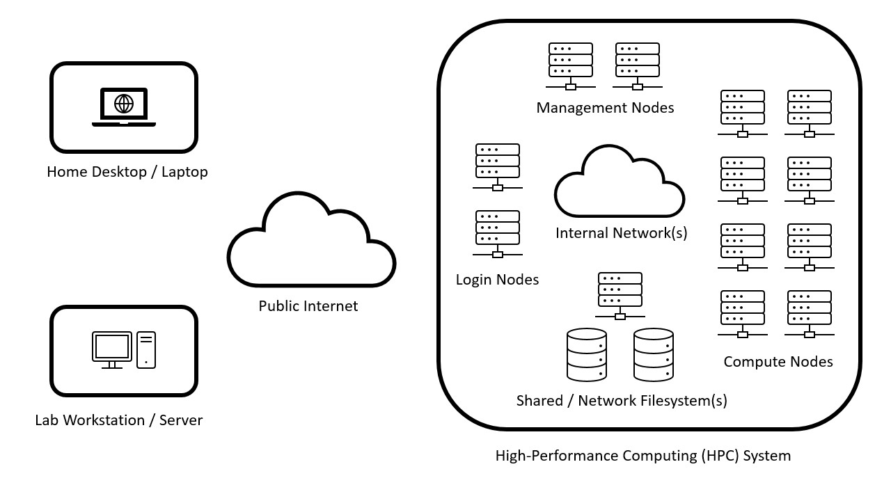
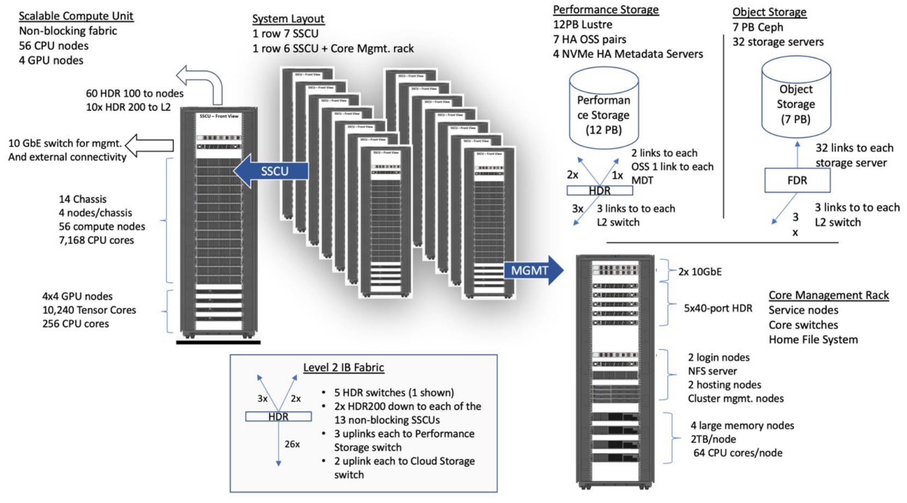
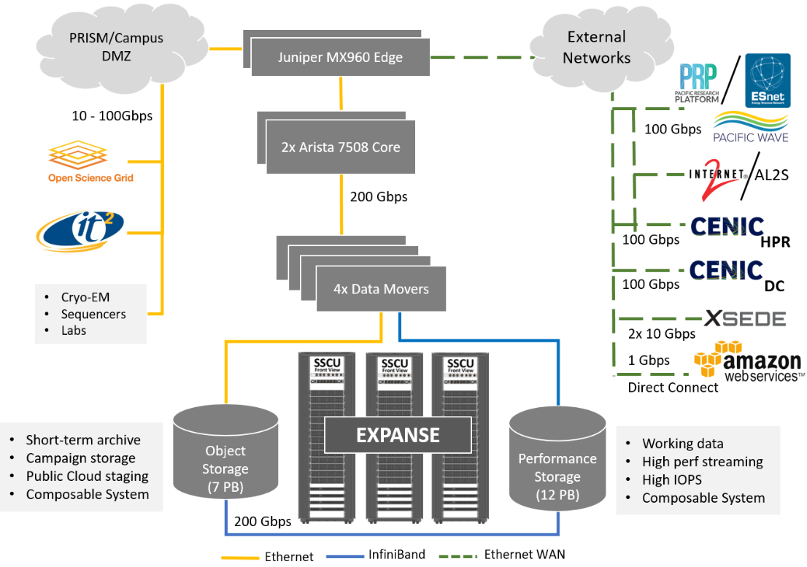
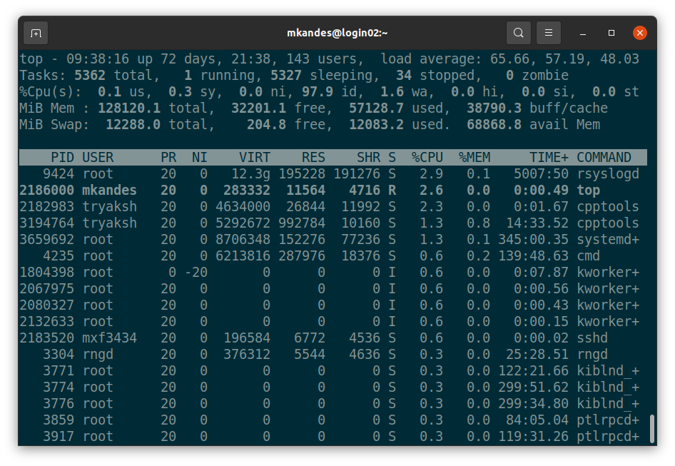
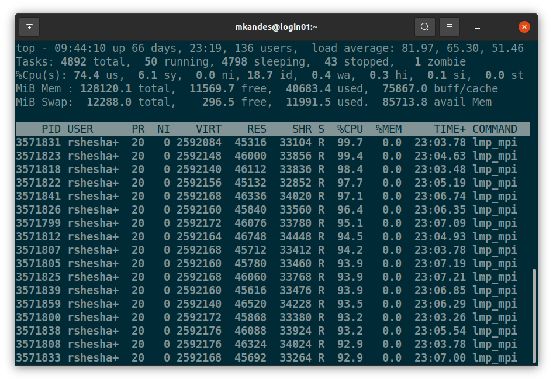

# Getting Started with Batch Job Scheduling: Slurm Edition

- [Nohup No Mas: Managing Linux processes](NOHUP.md)
- [From Zero to Batch: Your first batch job and more](BATCH.md)
- [Getting Your Fair-Share: How to negotiate with the scheduler](FAIRSHARE.md)
- [Beyond the Basics: Batch job arrays and dependencies](BEYOND.md)

## From Zero to Batch: Your first batch job and more

### Your Standard HPC Ecosystem



### HPC System Architecture



- [Expanse: Computing Without Boundaries](https://expanse.sdsc.edu)
- [Expanse: Building a Supercomputer](https://www.youtube.com/watch?v=uNZyg6X_t3s)

### HPC Storage Systems & External Networks



### Managing an HPC System: The Scheduler

[Slurm](https://en.wikipedia.org/wiki/Slurm_Workload_Manager) is an open source, fault-tolerant, and highly 
scalable HPC resource manager and job scheduling system.


### Getting Started

Login to your HPC system.

*Command*

```
ssh username@login.expanse.sdsc.edu
```

*Output*

```
$ ssh username@login.expanse.sdsc.edu
Welcome to Bright release         9.0

                                                         Based on Rocky Linux 8
                                                                    ID: #000002

--------------------------------------------------------------------------------

                                 WELCOME TO
                  _______  __ ____  ___    _   _______ ______
                 / ____/ |/ // __ \/   |  / | / / ___// ____/
                / __/  |   // /_/ / /| | /  |/ /\__ \/ __/
               / /___ /   |/ ____/ ___ |/ /|  /___/ / /___
              /_____//_/|_/_/   /_/  |_/_/ |_//____/_____/

--------------------------------------------------------------------------------

Use the following commands to adjust your environment:

'module avail'            - show available modules
'module add <module>'     - adds a module to your environment for this session
'module initadd <module>' - configure module to be loaded at every login

-------------------------------------------------------------------------------
Last login: Wed Feb 15 14:35:40 2023 from 208.58.214.56
[username@login01 ~]$
```

And then take your first look around with `top`. 



You are not alone!

### The Rules of HPC Club



1. You do not run computationally-intensive work on the login nodes.
2. You DO NOT run computationally-intensive work on the login nodes.
3. All computationally-intensive work should be run as either a batch or interactive job on the compute nodes.
4. ... *To be continued* ...

*Command*

```
squeue
```

*Output*

```
[username@login01 ~]$ squeue
JOBID PARTITION     NAME     USER ST       TIME  NODES NODELIST(REASON)
          20730227   compute NGBW-JOB   cipres PD       0:00      1 (ReqNodeNotAvail, Reserved for maintenance)
          20743722   compute   abaqus   wsang1 PD       0:00      1 (ReqNodeNotAvail, Reserved for maintenance)
          20753059   compute tio2_tem    rw624 PD       0:00     14 (QOSMaxCpuPerUserLimit)
          20753111   compute tio2_tem    rw624 PD       0:00     14 (QOSMaxCpuPerUserLimit)
          20753161   compute tio2_tem    rw624 PD       0:00     14 (QOSMaxCpuPerUserLimit)
          20753205   compute tio2_tem    rw624 PD       0:00     14 (QOSMaxCpuPerUserLimit)
          20753204   compute tio2_tem    rw624 PD       0:00     14 (QOSMaxCpuPerUserLimit)
          20753211   compute tio2_tem    rw624 PD       0:00     14 (QOSMaxCpuPerUserLimit)
          20753212   compute tio2_tem    rw624 PD       0:00     14 (QOSMaxCpuPerUserLimit)
          20753213   compute tio2_tem    rw624 PD       0:00     14 (QOSMaxCpuPerUserLimit)
          20754621   compute    scav2  apham78 PD       0:00      4 (Dependency)
          20754620   compute    scav2  apham78 PD       0:00      4 (Dependency)
          20754619   compute    scav2  apham78 PD       0:00      4 (Dependency)
          20754618   compute    scav2  apham78 PD       0:00      4 (Dependency)
          20754617   compute    scav2  apham78 PD       0:00      4 (Dependency)
          20754616   compute    scav2  apham78 PD       0:00      4 (Dependency)
          20754615   compute    scav2  apham78 PD       0:00      4 (Dependency)
          20754614   compute    scav2  apham78 PD       0:00      4 (Dependency)
          20754613   compute    scav2  apham78 PD       0:00      4 (Dependency)
          20753239   compute tio2_tem    rw624 PD       0:00     14 (QOSMaxCpuPerUserLimit)
          20753215   compute tio2_tem    rw624 PD       0:00     14 (QOSMaxCpuPerUserLimit)
          20677210   compute D8.00_q0    healy PD       0:00     10 (Dependency)
          20677209   compute D8.00_q0    healy PD       0:00     10 (Dependency)
          20677230   compute D24.55_q    healy PD       0:00      6 (Dependency)
          20677228   compute D24.55_q    healy PD       0:00      6 (Dependency)
          20677221   compute D24.55_q    healy PD       0:00      6 (Dependency)
          20677219   compute D24.55_q    healy PD       0:00      6 (Dependency)
          20677218   compute D24.55_q    healy PD       0:00      6 (Dependency)
          20677217   compute D24.55_q    healy PD       0:00      6 (Dependency)
          20677216   compute D24.55_q    healy PD       0:00      6 (Dependency)
          18495201   compute NGBW-JOB  nsguser PD       0:00      1 (launch failed requeued held)
          20722553   compute Nf2L28Ru nkarthik  R 1-23:53:09      1 exp-3-22
          20723048   compute   nozzle  ajavadi  R 1-23:05:26      4 exp-8-[37-40]
          20723398   compute Nf2L28Ru nkarthik  R 1-22:33:52      1 exp-2-15
          20724107   compute Nf2L28Ru nkarthik  R 1-22:27:51      1 exp-2-34
          20725876   compute Nf2L28Ru nkarthik  R 1-22:24:51      1 exp-12-03
          20725886   compute Nf6L24Ru nkarthik  R 1-22:23:51      1 exp-3-03
          20726246   compute Nf6L24Ru nkarthik  R 1-22:01:47      1 exp-3-27
          20726270   compute Nf6L24Ru nkarthik  R 1-21:59:47      1 exp-10-47
          20726337   compute Nf6L28Ru nkarthik  R 1-21:55:47      1 exp-8-03
          20726350   compute Nf6L28Ru nkarthik  R 1-21:53:47      1 exp-8-02
          20726357   compute Nf6L28Ru nkarthik  R 1-21:51:47      1 exp-2-01
          20726375   compute Nf6L28Ru nkarthik  R 1-21:50:47      1 exp-14-27
          20726393   compute Nf6L28Ru nkarthik  R 1-21:47:47      1 exp-2-02
          20728441   compute test.scr ux451202  R 1-18:56:51     16 exp-14-[33-48]
          ...
          20756896    shared NGBW-JOB   cipres  R       1:16      1 exp-1-35
          20756920    shared NGBW-JOB   cipres  R       1:16      1 exp-1-31
          20756874    shared S724141_ zhanglab  R       1:16      1 exp-1-15
          20756881    shared S724141_ zhanglab  R       1:16      1 exp-1-29
          20756890    shared S724141_ zhanglab  R       1:16      1 exp-1-29
          20756900    shared S724141_ zhanglab  R       1:16      1 exp-1-29
          20756911    shared S724141_ zhanglab  R       1:16      1 exp-1-29
          20756923    shared S724141_ zhanglab  R       1:16      1 exp-1-29
          20756934    shared S724141_ zhanglab  R       1:16      1 exp-1-29
[username@login01 ~]$
```

### Clone the Repository


Next, let's clone the [4pi](https://github.com/mkandes/4pi) repo to your `HOME` directory on the HPC system.

*Command*

```
git clone https://github.com/mkandes/4pi.git
```

*Output*

```
[username@login01 ~]$ git clone https://github.com/mkandes/4pi.git
Cloning into '4pi'...
remote: Enumerating objects: 19, done.
remote: Counting objects: 100% (19/19), done.
remote: Compressing objects: 100% (10/10), done.
remote: Total 19 (delta 4), reused 19 (delta 4), pack-reused 0
Unpacking objects: 100% (19/19), 5.72 KiB | 7.00 KiB/s, done.
[username@login01 ~]$
```

### Your First Batch Job


Next Section - [Getting Your Fair-Share: How to negotiate with the scheduler](FAIRSHARE.md)
