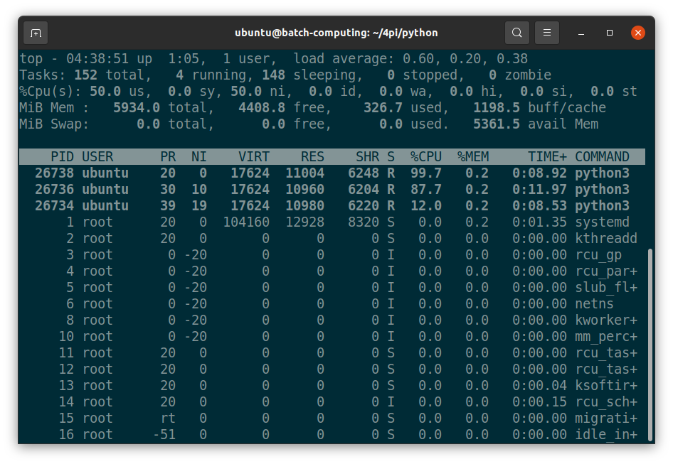

# Getting Started with Batch Job Scheduling: Slurm Edition

- [Nohup No Mas: Managing Linux processes](NOHUP.md)
- [From Zero to Batch: Your first batch job and more](BATCH.md)
- [Getting Your Fair-Share: How to negotiate with the scheduler](FAIRSHARE.md)
- [Beyond the Basics: Batch job arrays and dependencies](BEYOND.md)

## Nohup No Mas: Managing Linux processes

### What is a Process?


A [process](https://en.wikipedia.org/wiki/Process_(computing)) is the instance of [computer program](https://en.wikipedia.org/wiki/Computer_program)
that is being executed by one or more [threads](https://en.wikipedia.org/wiki/Thread_(computing)).

### Example Program: Estimating $\pi$ via Monte Carlo


To explore managing procesess, we'll need an example program to run. Here, we'll start by working with the [4pi](https://github.com/mkandes/4pi) project,
a collection of simple computer programs that estimate the value of $\pi$. Each program in the collection differs only in the programming language 
it was written in, the set of features of the language it utilized, and/or the fundamental underlying mathematical algorithm it implemented to approximate
the value of $\pi$. The aim of the project is to explore different aspects of each programming language and their feature sets from a scientific and 
high-performance computing perspective. The first set of programs included in the project estimate the value of $\pi$ via the Monte Carlo method. This 
solution is particularly useful for exploring different parallel programming models, languages, libraries, and APIs as it is an embarrassingly parallel
(albeit inefficient) solution to the problem.

### Clone the Repository

Start by cloning the repository to your local system.

*Command*
  ```
  git clone https://github.com/mkandes/4pi.git
  ```

*Output*
```
$ git clone https://github.com/mkandes/4pi.git
Cloning into '4pi'...
remote: Enumerating objects: 19, done.
remote: Counting objects: 100% (19/19), done.
remote: Compressing objects: 100% (10/10), done.
remote: Total 19 (delta 4), reused 19 (delta 4), pack-reused 0
Unpacking objects: 100% (19/19), 5.72 KiB | 977.00 KiB/s, done.
```

### Explore the Repository

Take a look at the code available in the repository. 

```
$ cd 4pi/
$ ls
bash  c  fortran  LICENSE.md  python  README.md
$ ls python/
pi.py
$ ls fortran/
Makefile  pi.f90  pi_omp.f90
$ cat fortran/Makefile 
COMPILER := gfortran
COMPILER_OPTIONS := -ffree-form -ffree-line-length-none -fimplicit-none \
                    -O3 -mtune=native -fdefault-integer-8 -fdefault-real-8

all: pi.x pi_omp.x

pi.x: pi.o
	$(COMPILER) $(COMPILER_OPTIONS) -o pi.x pi.o

pi.o: pi.f90
	$(COMPILER) $(COMPILER_OPTIONS) -c pi.f90

pi_omp.x: pi_omp.o
	$(COMPILER) $(COMPILER_OPTIONS) -fopenmp -o pi_omp.x pi_omp.o

pi_omp.o: pi_omp.f90
	$(COMPILER) $(COMPILER_OPTIONS) -fopenmp -c pi_omp.f90

.PHONY: clean
clean:
	rm *.x *.o
$
```

### Computing $\pi$ with Python

We'll start with `pi.py`, which requires only one command-line argument to be specified at runtime.

*Command*

```
python3 pi.py --help
```

*Output*

```
$ python3 pi.py --help
usage: pi.py [-h] [-v] samples

Estimate the value of Pi via Monte Carlo

positional arguments:
  samples        number of Monte Carlo samples

optional arguments:
  -h, --help     show this help message and exit
  -v, --verbose
$
```

### Estimating $\pi$ for the first time

Start by running `pi.py` with 1M samples, then increase the number of samples used to estimate $\pi$.

*Command* 

```
python3 pi.py 1000000
```

*Output*

```
$ python3 pi.py 1000000
3.14000314000314
$
```

### Measuring Runtime

Measure the runtime of the program with the [`time`](https://en.wikipedia.org/wiki/Time_%28Unix%29) command.

*Command* 

```
time -p python3 pi.py 1000000
```

*Output*

```
$ time -p python3 pi.py 1000000
3.1445391445391446
real 0.63
user 0.62
sys 0.01
$
```

### Background vs. Foreground Processes

A **foreground process** is a process that runs a shell command or program immediately upon instantiation by a user and may have its 
[input/output (I/O)](https://en.wikipedia.org/wiki/Input/output) directly connected to either a 
[command-line interface (CLI)](https://en.wikipedia.org/wiki/Command-line_interface) or a 
[graphical user interface (GUI)](https://en.wikipedia.org/wiki/Graphical_user_interface) to communicate with the user. All shell commands and 
user programs run as foregound processes by default. Foreground processes may also sometimes be referred to as *interactive processes*. 
Examples include your operating system's terminal application, your web broswer, and your video conferencing software.

In contrast, a [**background process**](https://en.wikipedia.org/wiki/Background_process) is a process that runs a program independently of 
any user interaction. As such, once instantiated, you don't have to wait for the process to complete to execute another one. Background 
processes may also sometime be referred to as *non-interactive processes*. Any software application that runs a 
[daemon](https://en.wikipedia.org/wiki/Daemon_(computing)) is utilizing background processes. Examples include the SSH server-side 
application that provides you remote access to your lab's workstation computer and the web server hosting this tutorial.

### View Running Processes

The [`top`](https://en.wikipedia.org/wiki/Top_(software)) command displays information about running processes such as 
CPU and memory utilization. The most *active*, resource-intensive processes are shown at the top of table.



In addition to providing summary resource usage statistics for the computer system as a whole, `top` displays the 
following information for each process by default:

- `PID`: Unique Process ID given to each process.
- `USER`: Username of the process owner.
- `PR`: Priority given to a process while scheduling.
- `NI`: ‘nice’ value of a process.
- `VIRT`: Amount of virtual memory used by a process.
- `RES`: Amount of physical memory used by a process.
- `SHR`: Amount of memory shared with other processes.
- `S`: state of the process 
- `%CPU`: Percentage of CPU used by the process.
- `%MEM` :Percentage of RAM used by the process.
- `TIME+`: Total CPU time consumed by the process.
- `COMMAND`: Command used to activate the process.

### Interrupt a Foreground Process from the Keyboard

Re-run `pi.py` with a large number of samples to increase its runtime (and accuracy) and then open another terminal to view the running process
with the `top` command.

*Command: Terminal 1* 

```
time -p python3 pi.py 1000000000
```

*Command: Terminal 2* 

```
top -u $USER
```

*Output: Terminal 2*

```
top - 03:55:23 up 21 min,  2 users,  load average: 0.19, 0.13, 0.16
Tasks: 150 total,   2 running, 148 sleeping,   0 stopped,   0 zombie
%Cpu(s): 49.8 us,  0.2 sy,  0.0 ni, 49.8 id,  0.0 wa,  0.0 hi,  0.2 si,  0.0 st
MiB Mem :   5934.0 total,   4422.3 free,    316.4 used,   1195.3 buff/cache
MiB Swap:      0.0 total,      0.0 free,      0.0 used.   5371.9 avail Mem 

    PID USER      PR  NI    VIRT    RES    SHR S  %CPU  %MEM     TIME+ COMMAND  
  26401 ubuntu    20   0   17612  10996   6252 R  99.7   0.2   0:10.55 python3  
  19423 ubuntu    20   0   19196  10036   8312 S   0.0   0.2   0:00.07 systemd  
  19425 ubuntu    20   0  104624   3640     12 S   0.0   0.1   0:00.00 (sd-pam) 
  19454 ubuntu    20   0  279488  13972  12096 S   0.0   0.2   0:00.04 pulseau+ 
  19456 ubuntu    39  19 1116580  23752  15876 S   0.0   0.4   0:00.10 tracker+ 
  19490 ubuntu    20   0    7396   4400   3892 S   0.0   0.1   0:00.03 dbus-da+ 
  19510 ubuntu    20   0  238872   7696   6808 S   0.0   0.1   0:00.01 gvfsd    
  19521 ubuntu    20   0  312812   6160   5560 S   0.0   0.1   0:00.00 gvfsd-f+
...
```

Return to the terminal running `pi.py` and interrupt the process by holding down the `ctrl` key with the letter `C` on your keyboard, 
which sends a `SIGINT` [signal](https://en.wikipedia.org/wiki/Signal_(IPC)) to the process and terminiates it immediately.

*Output: Terminal 1*

```
$ time -p python3 pi.py 1000000000
^C
Traceback (most recent call last):
  File "pi.py", line 29, in <module>
    z = math.sqrt(x**2 + y**2)
KeyboardInterrupt

real 81.93
user 81.91
sys 0.00
$
```

### Background a Process

You can run any command from your terminal as a background process by appending it with a space and then the ampersand (`&`) symbol. For example,
re-run `pi.py` with a large number of samples again.

*Command: Terminal 1* 

```
time -p python3 pi.py 1000000000 &
```

*Output: Terminal 1*

```
$ time -p python3 pi.py 1000000000 &
[1] 26503
$
```

After printing the`PID` of the background process to [standard output](https://en.wikipedia.org/wiki/Standard_streams), the shell prompt is 
returned to your control, where you can run another command such as viewing the background process with `top`. 

*Command: Terminal 1*

```
top -p "$(($!+1))"
```

*Output: Terminal 1*

```
top - 04:04:05 up 30 min,  2 users,  load average: 0.87, 0.60, 0.38
Tasks:   1 total,   1 running,   0 sleeping,   0 stopped,   0 zombie
%Cpu(s): 50.2 us,  0.0 sy,  0.0 ni, 49.8 id,  0.0 wa,  0.0 hi,  0.0 si,  0.0 st
MiB Mem :   5934.0 total,   4414.7 free,    321.5 used,   1197.9 buff/cache
MiB Swap:      0.0 total,      0.0 free,      0.0 used.   5366.6 avail Mem 

    PID USER      PR  NI    VIRT    RES    SHR S  %CPU  %MEM     TIME+ COMMAND  
  26504 ubuntu    20   0   17612  10964   6220 R 100.0   0.2   1:34.48 python3
```

Here, we've used the special environment variable `$!`, which returns the `PID` of the last executed command. Why do we add `+1` to this 
integer value?

### Kill a Background Process

While `top` continues to run on your `python3` command, [`kill`](https://en.wikipedia.org/wiki/Kill_(command)) the process from
the other terminal.

*Command: Terminal 2*

```
kill 26504
```

*Output: Terminal 2*

```
$ kill 26504
$
```

When executed, you should see the process `Terminated` and disappear from `top`'s process table. Next, exit `top` and restart `pi.py` 
from the same terminal.

*Command: Terminal 1*

```
time -p python3 pi.py 1000000000 &
```

*Output: Terminal 1*

```
$ time -p python3 pi.py 1000000000 &
[1] 26510
$
```

Then use `top` again to display the process, but from the other terminal.

*Command: Terminal 2*

```
top -p 26511
```

*Output: Terminal 2*

```
top - 04:08:23 up 34 min,  2 users,  load average: 0.93, 0.73, 0.50
Tasks:   1 total,   1 running,   0 sleeping,   0 stopped,   0 zombie
%Cpu(s): 50.1 us,  0.0 sy,  0.0 ni, 49.9 id,  0.0 wa,  0.0 hi,  0.0 si,  0.0 st
MiB Mem :   5934.0 total,   4415.4 free,    320.7 used,   1197.9 buff/cache
MiB Swap:      0.0 total,      0.0 free,      0.0 used.   5367.4 avail Mem 

    PID USER      PR  NI    VIRT    RES    SHR S  %CPU  %MEM     TIME+ COMMAND  
  26511 ubuntu    20   0   17612  10948   6204 R  99.5   0.2   2:01.61 python3
```

What happens if you close the original terminal where you restarted `pi.py`?

### Set It and Forget It

[`nohup`](https://en.wikipedia.org/wiki/Nohup) is short for *no hang up*. Any program started with the `nohup` command will ignore 
the [`SIGHUP`](https://en.wikipedia.org/wiki/SIGHUP) signal and, therefore, allow the program and its process to continue to run,
even after closing or exiting the terminal. 

Restart `pi.py` with `nohup`, but with a fewer samples. 

*Command*

```
nohup time -p python3 pi.py 100000000 &
```

*Output*

```
$ nohup time -p python3 pi.py 100000000 &
[1] 26663
$ nohup: ignoring input and appending output to 'nohup.out'
$ top -u $USER
[1]+  Done                    nohup time -p python3 pi.py 100000000
$ cat nohup.out 
3.1416010314160103
real 62.66
user 62.63
sys 0.00
```

### Controlling Priority

When managing processes on a shared, multi-user system, it's always good practice to also control 
the priority of your processes as all systems have a limited amount of compute resources available 
at any given time. 

[`nice`](https://en.wikipedia.org/wiki/Nice_(Unix)) is the command that allows you to assign and 
execute a program with a relative CPU priority, which affects how the process is 
***[scheduled](https://en.wikipedia.org/wiki/Scheduling_(computing))*** by the operating system. 
A *niceness* of -20 is the highest priority value that can be assigned to a process, while 
19 is the lowest. Note, however, only the `root` user can set the nice values from -20 to 19. 
Regular users can only use nice values between 0 and 19. The default value is 0. 

*Command*

```
nohup nice -n 19 time -p python3 pi.py 100000000 &
```

```
nohup nice time -p python3 pi.py 100000000 &
```

```
nohup time -p python3 pi.py 100000000 &
```

*Output*

```
$ nohup nice -19 time -p python3 pi.py 100000000 &
[1] 26684
$ nohup: ignoring input and appending output to 'nohup.out'
$ nohup nice time -p python3 pi.py 100000000 &
[2] 26686
$ nohup: ignoring input and appending output to 'nohup.out'
$ nohup time -p python3 pi.py 100000000 &
[3] 26688
$ nohup: ignoring input and appending output to 'nohup.out'
$ top -u $USER
top - 04:24:03 up 50 min,  1 user,  load average: 1.24, 0.89, 0.75
Tasks: 151 total,   4 running, 147 sleeping,   0 stopped,   0 zombie
%Cpu(s): 50.0 us,  0.0 sy, 50.0 ni,  0.0 id,  0.0 wa,  0.0 hi,  0.0 si,  0.0 st
MiB Mem :   5934.0 total,   4424.2 free,    311.8 used,   1197.9 buff/cache
MiB Swap:      0.0 total,      0.0 free,      0.0 used.   5376.4 avail Mem 

    PID USER      PR  NI    VIRT    RES    SHR S  %CPU  %MEM     TIME+ COMMAND  
  26689 ubuntu    20   0   17624  10988   6228 R 100.0   0.2   0:20.58 python3  
  26687 ubuntu    30  10   17624  10932   6176 R  88.0   0.2   0:23.07 python3  
  26685 ubuntu    39  19   17624  11008   6252 R  12.0   0.2   0:15.51 python3
  19423 ubuntu    20   0   19312  10056   8312 S   0.0   0.2   0:00.07 systemd
...

$
[1]   Done                    nohup nice -19 time -p python3 pi.py 100000000
[2]-  Done                    nohup nice time -p python3 pi.py 100000000
[3]+  Done                    nohup time -p python3 pi.py 100000000
$ cat nohup.out 
3.1416010314160103
real 62.66
user 62.63
sys 0.00
3.1416058314160584
real 61.26
user 61.23
sys 0.00
3.1416926314169262
real 67.51
user 60.09
sys 0.00
3.1417805114178052
real 115.07
user 61.15
sys 0.00
$
```

#

Next Section - [From Zero to Batch: Your first batch job and more](BATCH.md)
